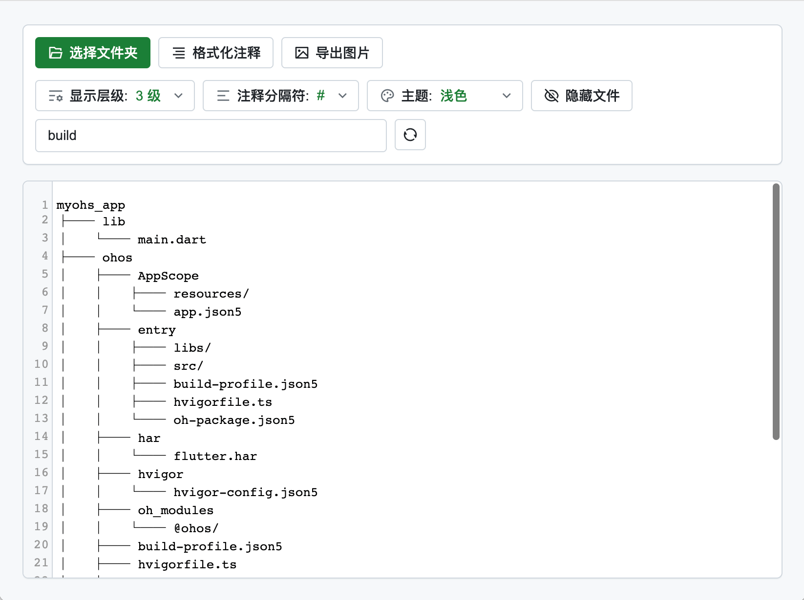
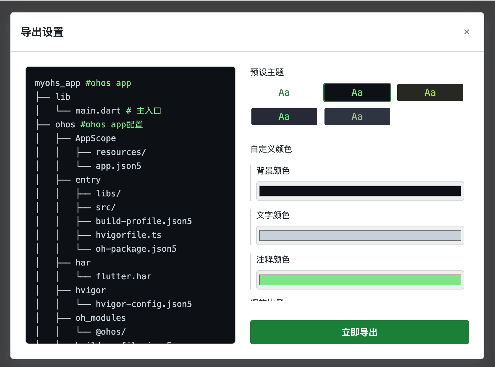

## 目录树生成器
基于utools的桌面应用开发的目录树生成器插件，支持文件夹扫描和树形结构导出为图片。

#### 功能

- 1.支持生成树形目录结构图
- 2.支持复制和编辑注释
- 3.支持导出成图片以及导出样式美化
- 4.支持浅色和深色主题
- 5.支持utools右键菜单快速为选择的目录生成目录树
- 6.支持导出生成1x,2x,3x图

#### 使用

1. 安装[utools](https://u.tools/)桌面应用
2. 搜索安装目录树生成器插件
3. 打开插件，选择文件夹，即可生成目录树
4. 在弹出的保存对话框中选择保存路径和文件名，点击保存
5. 支持utools右键菜单，选择文件夹，即可生成目录树

#### 截图

